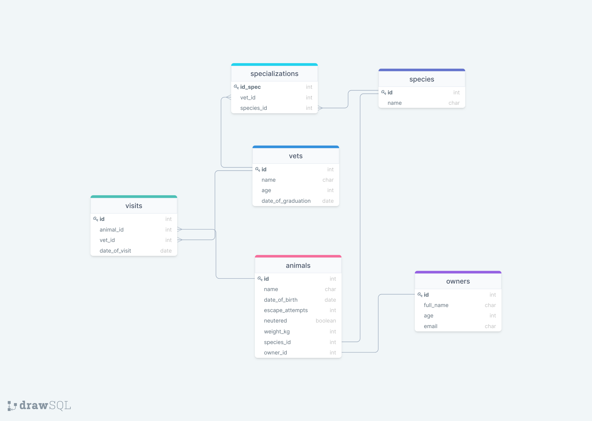

# Veterinary-Clinic-Database

> A simple databases for a veterinary clinic.
> It contains basic data about the animals that are stored in the clinic.
> Right now it only contains a table called `animals` that contains the following fields:
> 
  * id:                 integer
  * name:               string
  * date_of_birth:      date
  * escape_attempts:    integer
  * neutered:           boolean
  * weight_kg:          decimal

A brief description of the name of the animals, their date of birth, the escape attempts, if is neutered and their weight on Kg.

## Getting Started

This repository includes files with plain SQL that can be used to recreate a database:

- Use [schema.sql](./schema.sql) to create all tables.
- Use [data.sql](./data.sql) to populate tables with sample data.
- Check [queries.sql](./queries.sql) for examples of queries that can be run on a newly created database. **Important note: this file might include queries that make changes in the database (e.g., remove records). Use them responsibly!**

## Authors

👤 **Author1**

- GitHub: [@theluisabarca](https://github.com/TheLuisAbarca)
- Twitter: [@twitterhandle](https://twitter.com/TheLuisAbarca)
- LinkedIn: [LinkedIn](https://linkedin.com/in/techadvisor-luis-abarca/)

## 🤝 Contributing

Contributions, issues, and feature requests are welcome!

Feel free to check the [issues page](../../issues/).

## Show your support

Give a ⭐️ if you like this project!

## Acknowledgments

- Hat tip to anyone whose code was used
- Inspiration
- etc

## 📝 License

This project is [MIT](./MIT.md) licensed.
